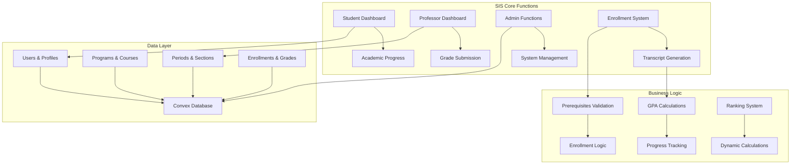
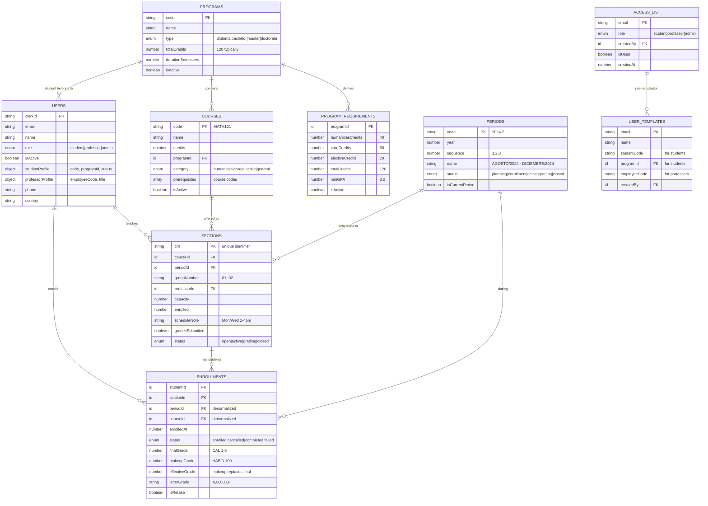

# Alef University - Student Information System (SIS)

A serverless **Student Information System** implementation using Convex database and TypeScript, optimized for 250 students and 20 professors.

## 🎯 System Overview

This project implements a **minimalist SIS** focused on core academic functions:
- **Grade management** (CAL/HAB scales)
- **Transcript generation** 
- **Academic progress tracking** (40-60-20 credit system)
- **Course enrollment** with prerequisite validation
- **Period-based** academic structure

## 🏗️ Architecture



## 📚 Academic Model

### **Credit System (40-60-20)**
- **40 credits**: Humanities courses
- **60 credits**: Core program courses (Troncales)
- **20 credits**: Elective courses
- **Total**: 120 credits for graduation

### **Grading Scales**
- **CAL Scale**: 1.0 - 5.0 (Final grades)
- **HAB Scale**: 0 - 100 (Makeup exams)
- **Effective Grade**: Makeup grade replaces final grade when taken
- **Passing Grade**: 3.0 minimum

### **Period Structure**
- Uses **periods** instead of semesters
- Format: "AGOSTO/2024 - DICIEMBRE/2024"
- Status: planning → enrollment → active → grading → closed

## 📁 SIS Functions Structure

### **Core SIS Modules (9 files)**

| Module | Functions | Purpose |
|--------|-----------|---------|
| **`auth.ts`** | `getCurrentUser`, `registerUser`, `preRegisterStudent`, `preRegisterProfessor` | Authentication with Clerk, pre-registration system |
| **`users.ts`** | `getUserById`, `listStudents`, `updateUserProfile`, `activateUser` | User management and profiles |
| **`programs.ts`** | `getPrograms`, `createProgram`, `createProgramRequirements` | Academic programs with 40-60-20 credit structure |
| **`courses.ts`** | `getCoursesByProgram`, `getCourseById`, `getPendingCourses`, `createCourse` | Course catalog and pensum tracking |
| **`sections.ts`** | `getSectionsByPeriod`, `getProfessorSections`, `createSection` | Course sections with professor assignment |
| **`enrollments.ts`** | `enrollStudent`, `submitGrades`, `submitMakeupGrade`, `getTranscript` | Student enrollment and grade management |
| **`studentDashboard.ts`** | `getStudentDashboard`, `getStudentProgress`, `getStudentPeriodSummary` | Student academic progress view |
| **`professorDashboard.ts`** | `getProfessorDashboard`, `getClassList`, `getProfessorSchedule` | Professor class management |
| **`admin.ts`** | `bulkCreateStudents`, `generatePeriodRankings`, `closePeriod`, `getSystemStats` | Administrative functions |

### **Support Files**
- **`schema.ts`**: Complete SIS database schema
- **`types.ts`**: TypeScript interfaces and validators  
- **`helpers.ts`**: Business logic and validation helpers
- **`auth.config.ts`**: Clerk authentication configuration

## 🗄️ SIS Database Schema

Optimized schema for **Student Information System** with 9 core tables:



## 📂 Project Structure

```
convex/
├── 📋 Core SIS Functions
│   ├── auth.ts              # Authentication & registration
│   ├── users.ts             # User management
│   ├── programs.ts          # Academic programs
│   ├── courses.ts           # Course catalog
│   ├── sections.ts          # Course sections
│   ├── enrollments.ts       # Enrollment & grades
│   ├── studentDashboard.ts  # Student interface
│   ├── professorDashboard.ts # Professor interface
│   └── admin.ts             # Administrative functions
│
├── 🔧 System Foundation
│   ├── schema.ts            # Database schema
│   ├── types.ts             # TypeScript definitions
│   ├── helpers.ts           # Business logic utilities
│   └── auth.config.ts       # Clerk configuration
│
└── 🤖 Auto-generated
    └── _generated/          # Convex generated files
```

## 🎓 SIS Business Logic

### **Enrollment Validation**
```typescript
// Prerequisites must be completed
await hasCompletedPrerequisites(ctx, studentId, courseId)

// Section capacity not exceeded  
hasAvailableCapacity(section)

// Student not already enrolled in course for period
await isStudentEnrolledInCourse(ctx, studentId, courseId, periodId)
```

### **Grade Management**
```typescript
// CAL Scale: 1.0 - 5.0 (Final grades)
finalGrade: 4.2  // CAL

// HAB Scale: 0 - 100 (Makeup exams) 
makeupGrade: 85  // HAB

// Effective grade: makeup replaces final
effectiveGrade = makeupGrade || finalGrade
```

### **Academic Progress (40-60-20)**
```typescript
const progress = {
  humanitiesCredits: 32,     // Current / 40 required
  coreCredits: 45,           // Current / 60 required  
  electiveCredits: 15,       // Current / 20 required
  totalCredits: 92,          // Current / 120 total
  overallProgress: 76.7%     // Completion percentage
}
```

### **Dynamic Rankings**
```typescript
// Calculated real-time for 250 students
const ranking = {
  rank: 12,           // Student position
  total: 247,         // Total students in period
  gpa: 4.15,         // Period GPA
  percentile: 95.1   // Top percentage
}
```

## ⚙️ Technical Implementation

### **SIS Architecture Principles**
- **Minimalist Design**: Only essential features for grade management and transcripts
- **Optimized for Scale**: 250 students, 20 professors - no over-engineering
- **Period-based**: Academic periods instead of semesters
- **Dynamic Calculations**: Rankings computed in real-time, no cache tables
- **Type Safety**: End-to-end TypeScript with Convex validation

### **Key Technical Decisions**

**Simplified Grade Model**
```typescript
// NO complex activities table - grades stored directly in enrollments
interface Enrollment {
  finalGrade: number;      // CAL (1-5 scale)
  makeupGrade: number;     // HAB (0-100 scale) 
  effectiveGrade: number;  // What counts (makeup replaces final)
  letterGrade: string;     // For transcripts
}
```

**Optimized Queries**
```typescript
// Use indexes for frequent operations
.withIndex("by_student_period", ["studentId", "periodId"])
.withIndex("by_program_category", ["programId", "category"])
.withIndex("by_professor_period", ["professorId", "periodId"])
```

**Business Rule Validation**
```typescript
// Prerequisites, capacity, conflicts all validated in helpers
await requireAuth(ctx);
await requireRole(ctx, "admin");
await requireAdminOrSelf(ctx, userId);
```

### **What's NOT Implemented** ❌
- Complex assignment/activity system
- Detailed scheduling conflicts
- Extensive notification system  
- File upload/document management
- Complex reporting dashboards
- Student messaging system

### **Deployment & Setup**

1. **Install Dependencies**
```bash
npm install convex
npx convex dev
```

2. **Environment Setup**
```bash
# .env.local
CONVEX_DEPLOYMENT=your-deployment-url
NEXT_PUBLIC_CLERK_PUBLISHABLE_KEY=your-clerk-key
CLERK_SECRET_KEY=your-clerk-secret
```

3. **Database Initialization**
```bash
npx convex deploy
# Schema automatically applied
```

## 📊 System Capabilities

| Feature | Status | Scale |
|---------|--------|-------|
| **Student Management** | ✅ Complete | 250 students |
| **Professor Management** | ✅ Complete | 20 professors |
| **Course Catalog** | ✅ Complete | Unlimited courses |
| **Section Management** | ✅ Complete | Period-based |
| **Enrollment System** | ✅ Complete | With prerequisites |
| **Grade Management** | ✅ Complete | CAL/HAB scales |
| **Progress Tracking** | ✅ Complete | 40-60-20 credits |
| **Transcript Generation** | ✅ Complete | Period-grouped |
| **Dynamic Rankings** | ✅ Complete | Real-time calculation |
| **Admin Functions** | ✅ Complete | Bulk operations |

## 🚀 Ready for Production

This SIS is **production-ready** for Alef University with:
- ✅ Complete academic workflow
- ✅ Role-based security  
- ✅ Comprehensive validation
- ✅ Optimized performance
- ✅ Type-safe operations
- ✅ Real-time capabilities

Built with **Convex** for reliable, serverless academic management. 🎓

