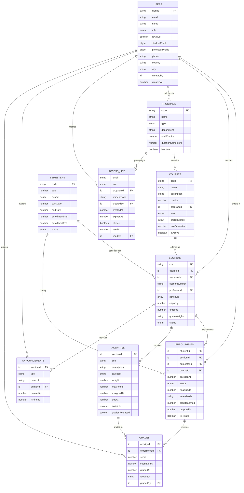

# Alef University - Convex Backend

A serverless backend implementation for university academic management using Convex database and TypeScript.

## Architecture Overview

This project implements a **serverless-first architecture** using Convex as the backend infrastructure:


### Key Components:
- **Convex Database**: Serverless database with real-time capabilities
- **TypeScript Functions**: Type-safe query and mutation functions
- **Academic Schema**: Complete university data model
- **Business Logic**: Academic rules and calculations

## Backend Architecture

### Convex Functions Structure

The backend is organized into four main TypeScript modules:

**Schema Definition** (`schema.ts`)
- Defines all database tables and relationships
- Implements indexes for optimal query performance
- Enforces data integrity through type validation

**Type System** (`types.ts`) 
- Reusable validators using Convex's type system
- Inferred TypeScript types for end-to-end safety
- Complex business types for academic operations

**Helper Functions** (`helpers.ts`)
- Academic business logic and calculations
- Data enrichment and transformation utilities
- Validation and authorization helpers

**API Functions** (`myFunctions.ts`)
- Query functions for data retrieval
- Mutation functions for data modification
- Real-time subscriptions for live updates

### Data Flow

1. **Queries**: Read operations that automatically subscribe to data changes
2. **Mutations**: Write operations that validate and transform data
3. **Real-time Updates**: Automatic propagation of changes to connected clients
4. **Type Safety**: Compile-time validation of all data operations

## Database Schema

The schema models a complete university academic system with the following entities:



## File Structure

```
convex/
├── schema.ts          # Database schema definition
├── types.ts           # TypeScript types and validators  
├── helpers.ts         # Utility functions and business logic
├── myFunctions.ts     # Main API functions
└── _generated/        # Auto-generated Convex files
```

## Academic Data Model

### **User Management**
- **Role-based system** (Student, Professor, Admin)
- **Student profiles** with academic progress tracking
- **Professor profiles** with department and title
- **Privacy settings** for profile visibility

### **Academic Structure**
- **Programs**: Bachelor's, Master's, Doctorate, Diploma
- **Courses**: Prerequisites, credit hours, area classification
- **Sections**: Schedule, capacity, professor assignment
- **Semesters**: Academic periods with enrollment windows

### **Enrollment System**
- **Prerequisites validation**
- **Capacity management**
- **Automatic conflict detection**
- **Grade tracking** with weighted categories

### **Grade Management**
- **Flexible activity types** (exams, assignments, projects)
- **Weighted grade calculations**
- **Colombian grading scale** (0-5, 3.0 minimum to pass)
- **Progress tracking** by academic area

## Academic Business Rules

### **Enrollment Validation**
- Prerequisites must be completed
- Section capacity not exceeded
- No schedule conflicts
- Student not already enrolled in course
- Enrollment period is active

### **Grade Calculation**
- Colombian scale: 0.0 - 5.0
- Minimum passing grade: 3.0
- Letter grades: A (4.5+), A- (4.0+), B+ (3.5+), B (3.0+), C (2.5+), F (<2.5)
- GPA weighted by credit hours

### **Academic Progress**
- Credits classified by area: Core, Elective, General
- Progress percentage based on total required credits
- Completion tracking per program requirements

## Technical Implementation

### **TypeScript Best Practices**
- Use generated types from `_generated/dataModel`
- Validators defined in `types.ts` for reusability
- Helper functions in separate module for business logic

### **Database Patterns**
- Denormalize frequently queried fields
- Use compound indexes for complex queries
- Store flexible data as JSON strings when needed

### **Error Handling**
- Custom `AppError` class with error codes
- Descriptive error messages for UI
- Proper HTTP status codes for API responses

